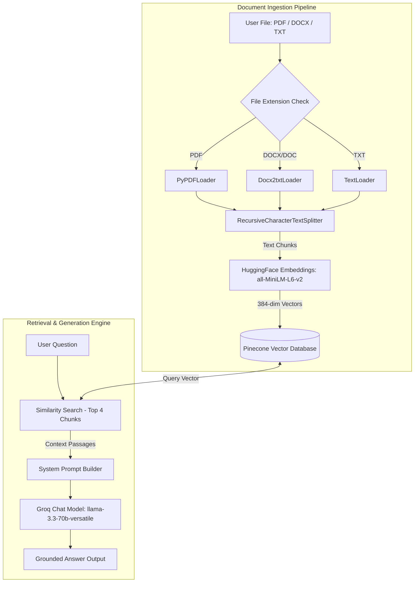

# DocuMind AI — Intelligent Document RAG Assistant

> An end-to-end, ultra-fast **Retrieval-Augmented Generation (RAG)** intelligence system supporting multi-format document ingestion (**PDF, Word `.docx/.doc`, Text `.txt`**), **Local HuggingFace Embeddings**, **Pinecone Vector Database**, and **Groq Llama 3.3 70B** LLM orchestration.

---

## 🏗️ System Architecture

```
                    ┌─────────────────────────────────────────────────────────┐
                    │               DOCUMENT INGESTION PIPELINE               │
                    └─────────────────────────────────────────────────────────┘
                                                 │
            ┌────────────────────────────────────┼────────────────────────────────────┐
            ▼                                    ▼                                    ▼
     [ PDF Documents ]                   [ Word (.docx/.doc) ]                [ Text (.txt) ]
     (PyPDFLoader)                       (Docx2txtLoader)                     (TextLoader)
            │                                    │                                    │
            └────────────────────────────────────┼────────────────────────────────────┘
                                                 │
                                                 ▼
                             [ RecursiveCharacterTextSplitter ]
                               (Chunk Size: 3000 | Overlap: 300)
                                                 │
                                                 ▼
                             [ Local HuggingFace Embeddings ]
                             (all-MiniLM-L6-v2 | 384 dimensions)
                                                 │
                                                 ▼
                               [ Pinecone Serverless Vector Store ]
                                (ragtext index | Cosine Metric)
                                                 │
                                                 │
                    ┌────────────────────────────┴────────────────────────────┐
                    │              RETRIEVAL & ANSWER GENERATION              │
                    └─────────────────────────────────────────────────────────┘
                                                 │
                                                 ▼
                                         [ User Question ]
                                                 │
                                                 ▼
                                     [ Pinecone Similarity Search ]
                                        (Top-k = 4 Passages)
                                                 │
                                                 ▼
                                     [ Context-Grounded Prompt ]
                                                 │
                                                 ▼
                                   [ Groq Llama 3.3 70B Versatile ]
                                        (Sub-second Inference)
                                                 │
                                                 ▼
                                     [ Final Structured Answer ]
```

### Mermaid Diagram



---

## ✨ Key Features

- ⚡ **Ultra-Fast Local Embeddings**: Powered by HuggingFace `all-MiniLM-L6-v2` running 100% locally. Processes 300+ document chunks in **under 2 seconds** with **zero API rate limits** and **zero cost**.
- 📄 **Multi-Format Document Support**: Seamlessly ingest and query `.pdf`, `.docx`, `.doc`, and `.txt` files.
- 🧠 **Groq Llama 3.3 70B Orchestration**: High-throughput LLM reasoning providing precise, context-bounded answers strictly grounded in document text.
- 🛡️ **Fail-Safe Agentic Fallback**: Robust error-handling with automatic batching, exponential backoff, and direct RAG retrieval fallback to prevent API syntax failures.
- 🌐 **Modern Glassmorphic Web Dashboard**: Complete web UI built with FastAPI, feature-rich interactive modules (Drag-and-Drop Uploader, Real-Time Ingestion Stepper, Prediction Interface, Results Analytics).

---

## 📁 Project Structure

```
DocuMind-AI-Intelligent-Document-RAG-Assistant/
├── app.py                   # FastAPI backend server & REST API routes
├── config.py                # Setup: Env vars, HuggingFace embeddings & Pinecone index
├── rag_agent.py             # Agentic RAG engine: tool retrieval + Groq LLM logic
├── ingest.py                # CLI script for direct document ingestion
├── requirements.txt         # Project dependencies
├── .env.example             # Environment variable template
├── README.md                # Project documentation
├── uploads/                 # Uploaded document storage
├── frontend/                # Web UI application source
│   ├── index.html
│   ├── css/
│   │   ├── variables.css
│   │   ├── main.css
│   │   └── components.css
│   └── js/
│       ├── app.js
│       ├── api.js
│       ├── state.js
│       └── components/
│           ├── Header.js
│           ├── Hero.js
│           ├── Features.js
│           ├── Prediction.js
│           ├── Dashboard.js
│           ├── History.js
│           ├── About.js
│           └── Footer.js
└── static/                  # Static web server mount directory
```

---

## 🚀 Quick Start Guide

### 1. Prerequisites
- Python **3.10+**
- Free **Pinecone API Key** ([Pinecone Console](https://app.pinecone.io))
- Free **Groq API Key** ([Groq Console](https://console.groq.com))

### 2. Installation

Clone the repository and install dependencies:

```bash
git clone https://github.com/hsachan295-source/DocuMind-AI-Intelligent-Document-RAG-Assistant.git
cd DocuMind-AI-Intelligent-Document-RAG-Assistant

# Create virtual environment (optional but recommended)
python -m venv venv
# On Windows:
venv\Scripts\activate
# On macOS/Linux:
source venv/bin/activate

# Install requirements
pip install -r requirements.txt
```

### 3. Environment Setup

Create a `.env` file in the root directory:

```env
PINECONE_API_KEY=your_pinecone_api_key_here
PINECONE_INDEX_NAME=ragtext
GROQ_API_KEY=your_groq_api_key_here
GOOGLE_API_KEY=your_google_api_key_here  # Optional
```

> **Note**: `config.py` automatically detects and creates the 384-dimensional Pinecone index on startup if it doesn't already exist.

---

## 💻 Running the Application

### Launch the Web Application (FastAPI + Web UI)

```bash
python -m uvicorn app:app --host 127.0.0.1 --port 8000
```

Open your browser and navigate to: **`http://localhost:8000`**

### Command Line Interface (CLI)

**Ingest a document:**
```bash
python ingest.py --file ./uploads/sample_doc.docx
```

**Ask a question:**
```bash
python rag_agent.py --question "What is the summary of the document?"
```

---

## 📡 API Reference

| Method | Endpoint | Description |
|---|---|---|
| `POST` | `/upload` | Receives PDF/DOCX/TXT file and triggers background ingestion |
| `POST` | `/ask` | Queries the RAG pipeline with a user question |
| `GET` | `/status` | Returns current ingestion status and document metadata |
| `GET` | `/` | Serves the web dashboard interface |

---

## 🛠️ Technology Stack

- **Framework**: LangChain, FastAPI, Uvicorn
- **LLM Engine**: Groq (`llama-3.3-70b-versatile`)
- **Embeddings**: HuggingFace (`all-MiniLM-L6-v2`)
- **Vector Database**: Pinecone (Serverless)
- **Document Parsers**: PyPDFLoader, Docx2txtLoader, TextLoader
- **Frontend**: Vanilla HTML5, Modern CSS3 (Glassmorphism & Custom Tokens), Modular ES6 JS

---

## 📝 License

Distributed under the MIT License. See `LICENSE` for more details.
